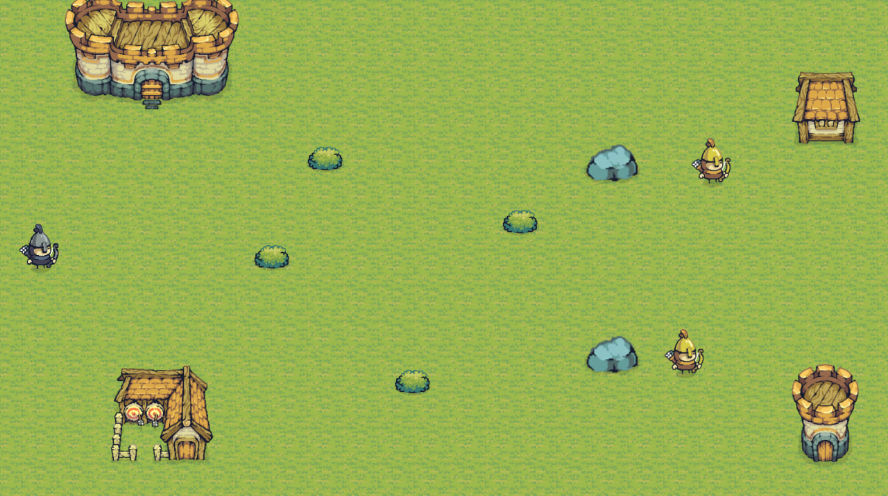
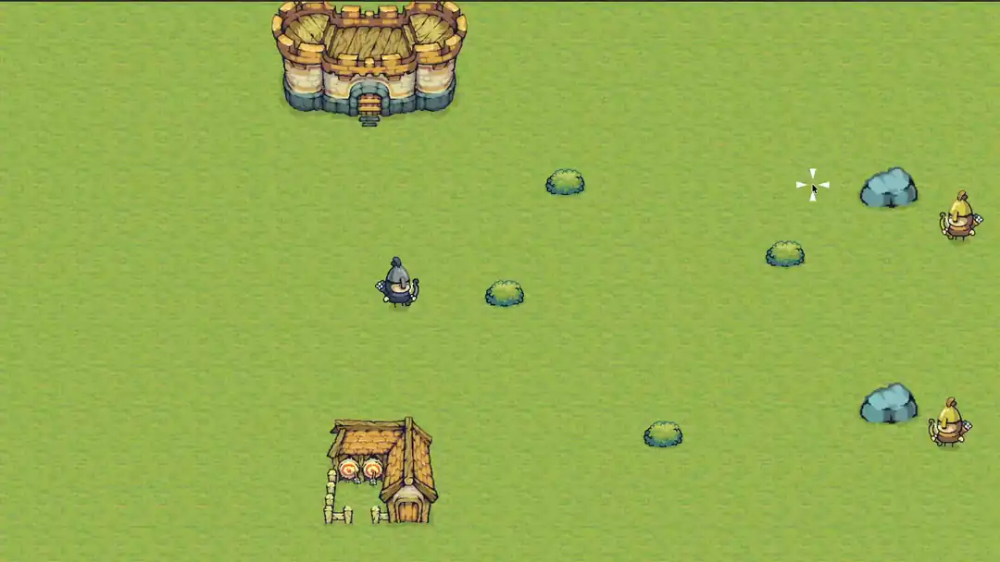
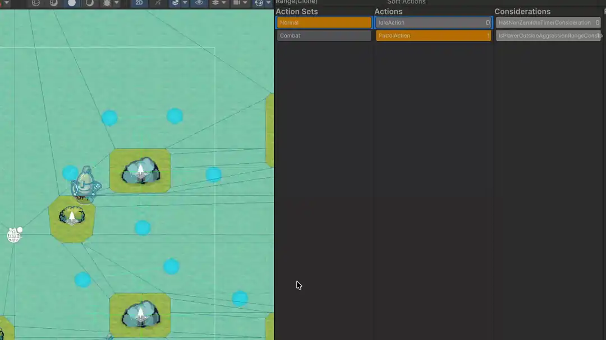

# Static Top Down Shooter

A 2D top-down shooter built in Unity 6 on the [StaticEcs][staticecs-link] framework. The player runs around a map shooting at enemies that use Utility AI to find cover and return fire. Everything ticks inside one ECS world across three system groups: input, update, physics.





## Key dependencies

- [StaticEcs][staticecs-link] for ECS
- [NavMeshPlus][navmesh-plus] for NavMesh
- [Wise Feline (Lite)][wise-feline] for Utility AI

## Controls

| Action | Binding        |
|--------|----------------|
| Move   | WASD or arrows |
| Aim    | Mouse          |
| Shoot  | Left mouse     |
| Dash   | Space          |

Bindings live in `Settings/InputMap/PlayerInputActions.inputactions`.

## Project layout

```
src/StaticTopDownShooter/             Unity project (6000.3.10f1)
└── Assets/
    ├── _Project/
    │   ├── Code/
    │   │   ├── Common/Extensions/    Transform, Vector, Enumerable, Numeric helpers
    │   │   ├── Editor/               Editor-only assembly
    │   │   └── Gameplay/
    │   │       ├── Core/             ECS bootstrap, world type, providers, registrars
    │   │       ├── Common/           Collision broadcasters, time, transform refs
    │   │       ├── Input/            PlayerInputActions wrapper + emit systems
    │   │       └── Features/
    │   │           ├── Aim/          Cursor-driven reticle
    │   │           ├── Ai/           Edited Wise Feline utility-AI core + editor
    │   │           ├── Animation/    Sprite and Animator wiring
    │   │           ├── Cameras/      Camera follow
    │   │           ├── Enemy/        Tags, AI considerations and actions, cover system
    │   │           ├── Lifetime/     HP, damage, death events
    │   │           ├── Movement/     Rigidbody2D move and dash
    │   │           ├── Player/       Player tag
    │   │           └── Weapon/       Bullet spawn, fire-rate gate, recoil, hit damage
    │   ├── Art/                      Project-authored animations + tilemap palette
    │   ├── Resources/Gameplay/       Runtime-loaded prefabs (Bullet, Rock, settings)
    │   ├── Scenes/Battle.unity       Gameplay scene with baked 2D NavMesh
    │   └── Settings/                 InputMap, URP, Editor configs
    └── ThirdParty/Tiny Swords/       Pixel art pack
```

## Architecture

`EcsRunner` is the only bootstrap MonoBehaviour. On `Start` it creates one Game world, registers every `IComponent` / `ITag` / `IEvent` / `IResource` it can find in the `Shooter` assembly, then builds three system groups:

| Group       | Tick           | Runs                                                                                            |
|-------------|----------------|-------------------------------------------------------------------------------------------------|
| InputSys    | Update (early) | Reads Unity input, emits move and aim events. Also where enemy AI rethinks and steers.          |
| UpdateSys   | Update         | Aim, shoot cooldown, bullet spawn, dash, damage, animation, camera follow, view cleanup.        |
| PhysicsSys  | FixedUpdate    | Rigidbody2D movement, impulse application, bullet rotation toward velocity.                     |

Scene entities are created by `AbstractStaticEcsEntityProvider` components. Any MonoBehaviour implementing `IResourcesRegistrar` can register a shared resource (main camera, follow settings) at boot. Per-entity setup uses two MonoBehaviour layers: each scene entity has a `RootGameComponentsRegistrar` that holds a list of `GameEntityComponentsRegistrar` subclasses (`EnemyTagRegistrar`, `BrainComponentRegistrar`, `EntityColliderRegistrar`, and so on). At boot the root walks the list, and each subclass adds its tags or components to the entity.

Two StaticEcs entity-type markers (`IEntityType`) are declared: `CharacterET` for the player and enemies, `BulletET` for projectiles. They are framework identifiers, not Unity types, that StaticEcs uses to group entities of the same kind.

### Enemy AI



Enemies don't have their own movement code. The AI writes to the same `MoveInput` component (and aim pipeline) the player input fills, so movement, animation, and weapon systems treat them identically. It just decides what those inputs should be each frame.

A Utility AI sits behind each enemy. Every `RethinkInterval` seconds the `Brain` scores its available `Action`s against the current game state and switches to the highest scorer.

Actions:

- `Idle`: stand still while an internal timer runs down.
- `Patrol`: walk between waypoints in order.
- `MoveToCover`: pick the nearest cover point and navigate to it.
- `AttackFromCover`: face the player and fire from the current cover slot.

Pathfinding uses 2D NavMesh+ agents. The agent's `desiredVelocity` is written into `MoveInput` each frame, so the rest of the pipeline behaves the same as for the player.

### Collisions

`CollisionEventBroadcaster` is attached only to objects whose 2D collisions need to reach ECS (right now just the bullet prefab) and pushes their collision and trigger events into `GameEventProvider`. `ColliderRegistry` lets a system resolve a `Collider2D` back to its owning entity.

The damage chain runs through this same hub. When a bullet's trigger fires, `HandleBulletCollisionInputSystem` resolves the other collider to its entity and sends a `DamageEvent` for the target plus a `DeadEvent` for the bullet itself. `ApplyDamageSystem` then subtracts from `Hp` and emits a `DeadEvent` when health hits zero. `DestroyViewByDeadEventSystem` tears down the view GameObject for any entity it sees in a `DeadEvent`.

## Build and run

1. Install Unity 6000.3.10f1.
2. Open `src/StaticTopDownShooter/` in Unity Hub. The first import resolves the Git-based packages.
3. Open `Assets/_Project/Scenes/Battle.unity` and press Play.

## Resources

### Art

All third-party visuals sit in `Assets/ThirdParty/Tiny Swords/`.

- Tiny Swords pixel art pack by Pixel Frog: https://pixelfrog-assets.itch.io/tiny-swords


[staticecs-link]: https://github.com/Felid-Force-Studios/StaticEcs
[navmesh-plus]: https://github.com/h8man/NavMeshPlus
[wise-feline]: https://assetstore.unity.com/packages/tools/behavior-ai/wise-feline-lite-immersive-emergent-utility-ai-249840